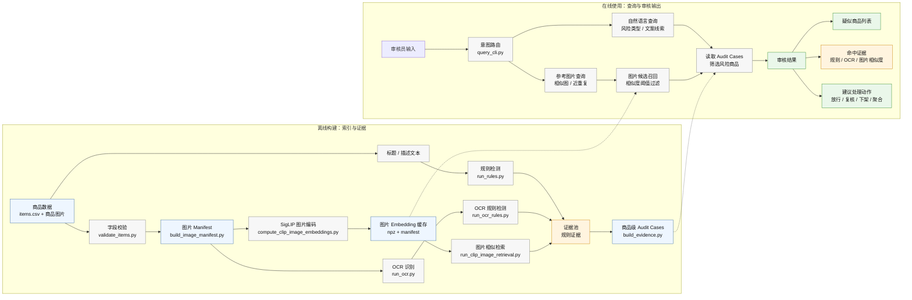

# 电商违规审核多模态检索系统

面向电商平台内容审核的多模态检索系统，用于从商品标题、详情文案、OCR 文本和商品图片中定位疑似违规商品，并生成可解释的审核证据链。

## 核心能力

- 规则检测：识别违禁商品、品牌侵权、站外导流、夸大宣传等风险。
- OCR 证据：识别商品图片中的文字，并对 OCR 文本执行违规规则检测。
- 图片检索：使用 SigLIP 生成商品图片 embedding，支持相似商品和近重复图片召回。
- 证据聚合：将规则、OCR、图片相似度等结果聚合为商品级 audit case。
- 查询入口：支持自然语言审核查询和参考图片查询。

## 系统流程



推荐视觉模型：

```text
google/siglip-base-patch16-224
```

## 目录结构

```text
configs/        风险标签、规则、查询路由配置
src/            核心模块：规则、OCR、检索、证据聚合、意图路由
scripts/        命令行入口
docs/           架构和部署说明
data/           用户自备商品数据
outputs/        运行输出
```

## 数据格式

准备 `data/items.csv`：

```csv
item_id,title,description,category,shop_id,image_paths,ocr_text,risk_labels,risk_objects,source,split
sku_000001,示例商品标题,示例商品详情,electronics,shop_001,data/images/sku_000001/main.jpg,,normal,,internal,test
```

其中 `image_paths` 支持多个图片路径，用 `|` 分隔。

支持的风险标签：

```text
prohibited_goods       违禁商品
counterfeit_brand      品牌侵权或假货风险
image_duplicate        盗图或重复铺货
off_platform_contact   导流或平台外交易
misleading_claim       夸大宣传
normal                 正常商品
```

## 快速开始

安装依赖：

```bash
python3 -m venv .venv
.venv/bin/python -m pip install -U pip
.venv/bin/python -m pip install -r requirements-cloud.txt
```

校验数据并构建图片 manifest：

```bash
.venv/bin/python scripts/validate_items.py \
  --items data/items.csv \
  --risk-labels configs/risk_labels.yaml

.venv/bin/python scripts/build_image_manifest.py \
  --items data/items.csv \
  --output data/image_manifest.csv
```

生成规则和 OCR 证据：

```bash
.venv/bin/python scripts/run_rules.py \
  --items data/items.csv \
  --rules configs/rules.yaml \
  --risk-labels configs/risk_labels.yaml

.venv/bin/python scripts/run_ocr.py \
  --items data/items.csv \
  --backend auto

.venv/bin/python scripts/run_ocr_rules.py \
  --ocr outputs/ocr/item_ocr.jsonl \
  --rules configs/rules.yaml \
  --risk-labels configs/risk_labels.yaml
```

生成图片 embedding 并执行图搜：

```bash
.venv/bin/python scripts/compute_clip_image_embeddings.py \
  --manifest data/image_manifest.csv \
  --model-name google/siglip-base-patch16-224 \
  --device auto \
  --output outputs/embeddings/siglip_image_embeddings.npz \
  --manifest-output outputs/embeddings/siglip_image_embeddings_manifest.csv

.venv/bin/python scripts/run_clip_image_retrieval.py \
  --embeddings outputs/embeddings/siglip_image_embeddings.npz \
  --manifest outputs/embeddings/siglip_image_embeddings_manifest.csv \
  --top-k 5 \
  --min-score 0.97
```

聚合审核 case：

```bash
.venv/bin/python scripts/build_evidence.py \
  --items data/items.csv \
  --evidence outputs/evidence/rule_evidence.jsonl \
  --evidence outputs/evidence/ocr_rule_evidence.jsonl \
  --evidence outputs/evidence/clip_image_similarity_evidence.jsonl \
  --include-clean
```

自然语言查询：

```bash
.venv/bin/python scripts/query_cli.py \
  --query "查一下加微信私聊的商品" \
  --items data/items.csv \
  --cases outputs/evidence/audit_cases.jsonl \
  --only-risk
```

参考图片查询：

```bash
.venv/bin/python scripts/query_cli.py \
  --query "查找相似商品图片" \
  --items data/items.csv \
  --cases outputs/evidence/audit_cases.jsonl \
  --query-image path/to/reference.jpg \
  --top-k 5 \
  --image-min-score 0.97
```

## 输出

系统输出商品级 audit case，包含：

- 商品 ID
- 风险类型
- 规则命中文本
- OCR 命中文本
- 相似图片匹配和分数
- 建议处理动作

建议处理动作：

```text
pass              放行
manual_review     人工复核
remove_or_block   下架或拦截
merge_duplicate   聚合处理
```

## 文档

- `docs/CLOUD_SETUP.md`：云端 GPU 和模型推理说明。
- `docs/IMAGE_MANIFEST_AND_EMBEDDINGS.md`：图片 manifest 与 embedding cache 设计。
- `docs/OCR_PIPELINE.md`：OCR 流程说明。

## License

本项目使用 [MIT License](LICENSE)。
